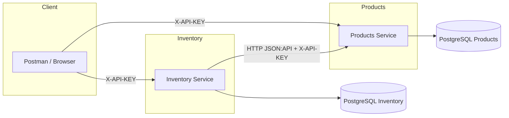

# Proyecto: Microservicios de Productos e Inventario

## Objetivo
Desarrollar dos microservicios independientes que interactúen entre sí: Productos e Inventario.

### Funcionalidades principales
- Crear productos.
- Realizar compras que descuenten del inventario.
- Implementar JSON API para todas las respuestas.
- Usar Docker para containerizar los servicios.
- Base de datos: PostgreSQL.

## Microservicio 1: Productos
### Modelo
- `Product` con los campos:
  - `id`
  - `nombre`
  - `precio`
  - `descripción` (opcional)

### Endpoints
- **POST /products**: Crear un nuevo producto.
- **GET /products/{id}**: Obtener un producto por ID.
- **GET /products**: Listar todos los productos.

## Microservicio 2: Inventario
### Modelo
- `Inventory` con los campos:
  - `producto_id`
  - `cantidad`

### Endpoints
- **GET /inventory/{productId}**: Consultar cantidad disponible.
- **PATCH /inventory/{productId}**: Actualizar cantidad disponible.
- **POST /purchases**: Registrar compras.

### Flujo de Compra
- **POST /purchases**:
  - Recibir el ID del producto y la cantidad a comprar.
  - Verificar disponibilidad en inventario.
  - Actualizar cantidad tras una compra exitosa.
  - Retornar información de la compra realizada.

## Comunicación entre Microservicios
- HTTP usando JSON API.
- Autenticación básica mediante API keys.
- Manejo de timeout y reintentos básicos.

## Pruebas
### Pruebas unitarias
- Creación de productos.
- Gestión de inventario.
- Proceso de compra.
- Manejo de errores (producto inexistente, inventario insuficiente).

### Pruebas de integración
- Comunicación entre microservicios.
- Flujo completo de compra.

## Documentación
- Swagger/OpenAPI disponible en tiempo de ejecución:
  - Products: http://localhost:8081/swagger-ui.html
  - Inventory: http://localhost:8086/swagger-ui.html
- Diagrama de arquitectura (Mermaid):



- Explicar decisiones técnicas y justificaciones.
- Documentar el uso de herramientas de IA en el desarrollo.

## Git Flow
- Seguir buenas prácticas de Git Flow:
  - Ramas: `develop`, `feature/*`, `release/*`, `hotfix/*`.
  - Realizar commits claros y descriptivos.

## Entregables
1. **Código fuente**:
   - Microservicios independientes con Docker Compose.
   - Pruebas unitarias e integración con cobertura ≥ 80%.
   - Sistema de logs estructurados.

2. **Documentación**:
   - `README.md` con instrucciones de instalación y ejecución.
   - Diagrama de arquitectura e interacción.
   - Justificación de decisiones técnicas.
   - Documentación de API con Swagger/OpenAPI.

3. **Repositorio público**:
   - Código organizado y siguiendo buenas prácticas.
   - Ejemplo de uso de herramientas de IA en el desarrollo.

## Próximos pasos
1. Configurar la estructura inicial del proyecto. (LISTO)
2. Implementar los modelos y endpoints básicos. (EN PROGRESO)
3. Configurar Docker y la base de datos. (PENDIENTE)
4. Desarrollar pruebas unitarias e integración. (PENDIENTE)
5. Documentar y preparar la entrega. (EN PROGRESO)

## Variables de entorno y propiedades

Productos (`products-service/src/main/resources/application.properties`):
- `SERVER_PORT` (por defecto 8081)
- `SPRING_DATASOURCE_URL`, `SPRING_DATASOURCE_USERNAME`, `SPRING_DATASOURCE_PASSWORD`
- `INTERSERVICE_API_KEY` (por defecto `change-me`)

Inventario (`inventory-service/src/main/resources/application.properties`):
- `server.port` (por defecto 8086)
- `products.base-url` (por defecto `http://localhost:8081`)
- `api.key` (por defecto `change-me`)
- `HTTP_CLIENT_TIMEOUT_MS` (por defecto `1500`)
- credenciales de PostgreSQL (local por defecto)

## Cómo ejecutar

En terminales separadas o usando perfiles/puertos distintos:

```bash
# Products service
cd products-service
./mvnw spring-boot:run

# Inventory service
cd ../inventory-service
./mvnw spring-boot:run
```

Accesos rápidos:
- Products Swagger: http://localhost:8081/swagger-ui.html
- Inventory Swagger: http://localhost:8086/swagger-ui.html
- Recuerda enviar el header `X-API-KEY: <valor de INTERSERVICE_API_KEY>`
