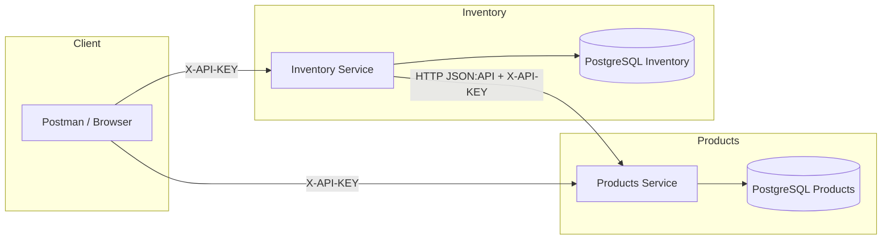
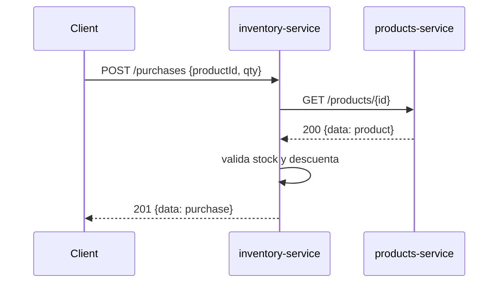

# Microservicios: Products e Inventory

Solución completa con dos microservicios independientes (Spring Boot 3, Java 21) que exponen APIs JSON:API, persisten en PostgreSQL, se comunican entre sí y se despliegan con Docker Compose. Incluye resiliencia (timeouts, reintentos y circuit breaker), autenticación por API key, Actuator/healthchecks, pruebas unitarias e integración, cobertura y documentación con OpenAPI.

## Requisitos previos
- Java 21 y Maven 3.9+
- Docker y Docker Compose
- cURL o Postman para probar

## Estructura del repositorio
- `products-service/`: CRUD de productos y consulta de precios
- `inventory-service/`: stock e ingestión de compras; invoca a `products-service`
- `docker-compose.yml`: orquestación de los 2 servicios y 2 PostgreSQL
- `.env`: variables de entorno para Compose (puertos, credenciales, API key)
- `AGENTS.md`: guía de trabajo asistido

## Decisiones técnicas (resumen)
- Base de datos: PostgreSQL en runtime por robustez y tipado; H2 en pruebas por velocidad y aislamiento. JPA/Hibernate con DDL auto `update` en Docker y `create-drop` en tests.
- Contrato JSON:API: respuestas con media type `application/vnd.api+json`, objetos `data`/`errors` consistentes.
- Comunicación entre servicios: HTTP (Spring Web/WebClient). `inventory-service` llama a `products-service` para validar producto/precio.
- Resiliencia: WebClient con timeout; Resilience4j (retry exponencial + circuit breaker) configurado en `inventory-service` para el cliente `productsClient`.
- Seguridad: API key en header `X-API-KEY`. Filtro sencillo en ambos servicios.
- Observabilidad: Actuator health con probes; healthchecks en Compose.

## Arquitectura



### Flujo de compra (secuencia)



## Justificación: endpoint de compras en inventory-service

El endpoint `POST /purchases` reside en `inventory-service` porque:

- Fuente de verdad del stock: el inventario es el agregado dueño del dato a mutar.
- Consistencia transaccional: descontar stock y persistir la compra ocurren en una única transacción del dominio de inventario.
- Menor acoplamiento: `products-service` expone el precio/validación; evitar efectos colaterales de inventario dentro de Products.
- Resiliencia y escalabilidad: los patrones de retry/circuit breaker hacia Products se gestionan desde Inventory sin bloquear la gobernanza del stock.
- Claridad del modelo: las compras son salidas de inventario; su auditoría y compensaciones pertenecen a este contexto.

## API y JSON:API

Media type: `application/vnd.api+json`.

Ejemplo éxito (Products: GET /products/1):

```json
{
  "data": {
    "type": "products",
    "id": "1",
    "attributes": {
      "name": "Mouse",
      "price": 49.9,
      "description": "Inalámbrico"
    }
  }
}
```

Ejemplo error (JSON:API errors):

```json
{
  "errors": [
    { "status": 404, "title": "Producto no encontrado", "detail": "No existe el id 999" }
  ]
}
```

Endpoints principales:
- Products: `POST /products`, `GET /products/{id}`, `GET /products`
- Inventory: `GET /inventory/{productId}`, `PATCH /inventory/{productId}`, `POST /purchases`

Autenticación: enviar `X-API-KEY: <valor>` en cada request.

### Validaciones de DTOs (Products)

- Campos y reglas principales (mensajes en español):
  - name: obligatorio, entre 2 y 80 caracteres.
  - price: obligatorio, rango [0, 1,000,000], precisión de hasta 7 dígitos enteros y 2 decimales (`@Digits(integer=7, fraction=2)`).
  - description: máximo 200 caracteres.
- Respuestas de validación: formato JSON:API (`application/vnd.api+json`) con `errors[*].source.pointer` apuntando al campo (por ejemplo, `/data/attributes/price`).
- Estricta conformidad JSON:API en creación (`POST /products`):
  - `Content-Type` debe ser `application/vnd.api+json` (si no, 415 Unsupported Media Type).
  - El header `Accept` debe incluir `application/vnd.api+json` (si no, 406 Not Acceptable).
  - `data.type` debe ser exactamente `"products"` (si no, 409 Conflict).
  - No se debe enviar `data.id` en creación (si está presente, 400 Bad Request).

### Estricta conformidad JSON:API (Inventory)

Inventory aplica reglas estrictas de negociación de contenido y formato:

- `produces`: todos los endpoints responden `application/vnd.api+json`.
- `consumes`: endpoints de escritura (`PATCH /inventory/{id}`, `POST /purchases`) exigen `Content-Type: application/vnd.api+json`.
- `Content-Type` incorrecto: 415 Unsupported Media Type con envelope JSON:API.
- `Accept` sin `application/vnd.api+json`: 406 Not Acceptable.
- Todas las respuestas de error (4xx/5xx) devuelven `Content-Type: application/vnd.api+json`.

Mapeos de errores y validaciones:

- 404 Not Found: producto inexistente reportado por `products-service`.
- 409 Conflict: stock insuficiente al intentar comprar.
- 400 Bad Request: cantidades inválidas.
- 401 Unauthorized: API key faltante/incorrecta.

Existen pruebas unitarias y de integración que validan 415/406 y estos errores de negocio con envelopes JSON:API.

## Resiliencia y timeouts
- WebClient con timeout `HTTP_CLIENT_TIMEOUT_MS` (ms).
- Retry exponencial y circuit breaker de Resilience4j para `productsClient` (inventario):
  - retry: `resilience4j.retry.instances.productsClient.*`
  - circuit breaker: `resilience4j.circuitbreaker.instances.productsClient.*`

## Actuator y healthchecks
- Actuator expone `/actuator/health` con probes.
- Docker Compose espera a que DBs y servicios estén UP antes de encadenar dependencias.

## Variables de entorno (.env)
Archivo `.env` en la raíz (usado por Compose):

```properties
PRODUCTS_DB_NAME=products
PRODUCTS_DB_USER=products
PRODUCTS_DB_PASS=products
PRODUCTS_DB_PORT=5433

INVENTORY_DB_NAME=inventory
INVENTORY_DB_USER=inventory
INVENTORY_DB_PASS=inventory
INVENTORY_DB_PORT=5434

PRODUCTS_PORT=8081
INVENTORY_PORT=8082

INTERSERVICE_API_KEY=local-secret
HTTP_CLIENT_TIMEOUT_MS=1500
HTTP_CLIENT_MAX_RETRIES=2
```

Propiedades relevantes en runtime:
- Products (`products-service/src/main/resources/application.properties`):
  - `SERVER_PORT` (default 8081)
  - `SPRING_DATASOURCE_URL/USERNAME/PASSWORD`
  - `INTERSERVICE_API_KEY`
- Inventory (`inventory-service/src/main/resources/application.properties`):
  - `SERVER_PORT` (default 8086; Compose lo fija a 8082)
  - `PRODUCTS_BASE_URL`
  - `INTERSERVICE_API_KEY`
  - `HTTP_CLIENT_TIMEOUT_MS`, `HTTP_CLIENT_MAX_RETRIES`

## Cómo ejecutar (local)

En terminales separadas:

```bash
# Products service
cd products-service
./mvnw spring-boot:run

# Inventory service
cd ../inventory-service
./mvnw spring-boot:run
```

URLs locales (por defecto):
- Products Swagger: http://localhost:8081/swagger-ui.html
- Inventory Swagger: http://localhost:8086/swagger-ui.html

Recuerda enviar el header `X-API-KEY: <valor de INTERSERVICE_API_KEY>`.

## Cómo ejecutar con Docker Compose

```bash
docker compose up --build -d
```

URLs con Compose:
- Products: http://localhost:8081
- Inventory: http://localhost:8082

Compose define healthchecks y dependencias; los servicios arrancan cuando sus DBs están healthy.

## Pruebas y cobertura

Ejecutar todo el monorepo:

```bash
mvn clean verify
```

Ejecución por módulo:

```bash
mvn -pl products-service test
mvn -pl inventory-service test
```

Reporte JaCoCo:
- `products-service/target/site/jacoco/index.html`
- `inventory-service/target/site/jacoco/index.html`

## Documentación OpenAPI
- Products: `/swagger-ui.html`
- Inventory: `/swagger-ui.html`

## Seguridad (API Key)
- Header requerido: `X-API-KEY`
- Valor provisto por `INTERSERVICE_API_KEY` (configurable en `.env` o propiedades)

## Git Flow y convenciones
- Ramas: `main`, `develop`, `feature/*`, `release/*`, `hotfix/*`
- Commits descriptivos; opcional Convencional Commits (feat, fix, docs, test, chore)
- PRs con descripción y checklist de pruebas

## Uso de IA en el desarrollo
Se utilizó asistencia de IA para:
- Generar esqueletos de controladores/servicios y DTOs JSON:API
- Configurar Resilience4j y Docker Compose
- Redactar pruebas y documentación

Todas las salidas se validaron con compilación, pruebas automatizadas y ejecución local/Compose.

## Troubleshooting
- Healthcheck falla en Inventory en Compose: verifique que `SERVER_PORT` se propague (ya soportado en `inventory-service`).
- Errores de conexión DB: confirme credenciales en `.env` y puertos libres.
- 401 Unauthorized: añada `X-API-KEY` correcto.

---

Autor: Equipo Linktic — Microservicios Products & Inventory
